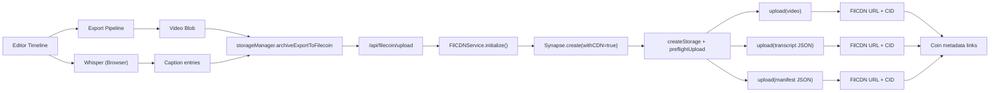

# Filecoin Architecture (Synapse SDK + FilCDN)

This document describes how SayWaht uses Filecoin Calibration for meaningful storage and retrieval, especially for exports that exceed Grove's 8MB sweet spot.

## Goals

- Keep short media fast with Grove/IPFS.
- Archive larger exports on Filecoin (FilCDN via Synapse SDK).
- Persist caption transcripts with the exported video.
- Return deterministic retrieval artifacts (video URL/CID, transcript URL/CID, manifest URL/CID).

## High-Level Flow



## Storage Policy

- **Strict 10s Cap**: All mobile projects and stock templates are capped at 10 seconds to ensure high reliability on Grove (< 8MB) and fast decentralized processing.
- **<= 8MB**: Grove/IPFS remains primary for lightweight uploads and ultra-fast retrieval.
- **> 8MB**: FilCDN/Filecoin is the automatic high-bandwidth fallback for larger exports or when Grove is under heavy load.
- **Captioned exports**: archive transcript JSON alongside video on FilCDN for permanent on-chain context.

## Integration Status

✅ **Verified Fallback (Feb 2026)**:
- Connection test script `scripts/test-filcdn-connection.mjs` confirmed successful handshake with Calibration network.
- Preflight checks validated sufficiency of storage allowance for large project archives.
- Signer `0x8502d079f93AEcdaC7B0Fe71Fa877721995f1901` is active and configured.

## Retrieval Model

Each export archive writes a manifest object that references:

- video CID + URL
- transcript CID + URL (if captions exist)
- manifest CID + URL
- metadata (project name, export method, duration, caption count)

This enables retrieval without relying on temporary runtime state.

## Runtime Components

- `apps/web/src/lib/filcdn.ts`
  - Synapse SDK initialization and upload helpers.
  - Supports `FILECOIN_CALIBRATION_RPC` override.

- `apps/web/src/lib/storage-manager.ts`
  - Multi-provider logic (Grove/FilCDN).
  - `archiveExportToFilecoin()` uploads video, transcript, and manifest.

- `apps/web/src/components/mint/steps/preview-step.tsx`
  - During mint preparation, exports video and archives video + transcript + manifest.
  - Passes retrieval URLs into metadata generation.

- `apps/web/src/app/api/filecoin/status/route.ts`
  - Timeout-safe Synapse health + allowance preflight checks.

## Environment Variables

Set in `apps/web/.env.local`:

```bash
FILECOIN_PRIVATE_KEY=your-filecoin-private-key
FILECOIN_WALLET_ADDRESS=0xYourWalletAddress
FILECOIN_CALIBRATION_RPC=https://api.calibration.node.glif.io/rpc/v1
NEXT_PUBLIC_FILECOIN_CALIBRATION_RPC=https://api.calibration.node.glif.io/rpc/v1
```

## Storacha Note

Storacha can be added as an optional second archival sink for transcript JSON and manifests. The current architecture already separates caption payloads, so duplicating transcript writes to Storacha is a straightforward extension.
